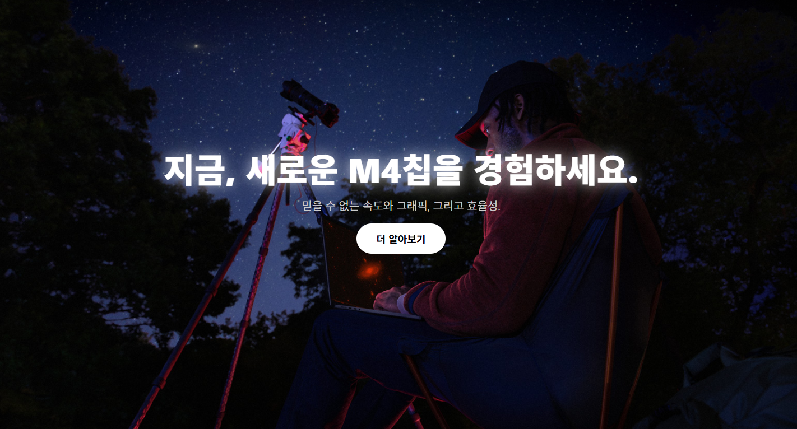

# 🍎 Apple M4 Pro 클론 프로젝트

> [🔗 바로가기](https://apple-clone-tan-delta.vercel.app/)

애플 공식 웹사이트의 제품 소개 섹션을 기반으로,  
"M4 칩" 출시 테마를 활용해 **프론트엔드 인터랙티브 UI/UX** 중심으로 클론한 웹 페이지입니다.
코딩 4일차 배운 html 과 css 를 활용 해 제작했습니다.

---

## ✅ 주요 기능

- ✨ **타이핑 애니메이션**  
  첫 화면에서 자연스러운 타이핑 효과로 시선을 끄는 Hero Section 구성

- 💻 **M4 이미지 스크롤 확대**  
  스크롤에 따라 자연스럽게 확대되는 M4 칩 이미지 연출

- 🎨 **감성 디자인 슬라이드**  
  사용자가 클릭할 때마다 디자인 감성 이미지를 전환하며  
  애플 특유의 고급스러움과 미니멀리즘 전달

- 🧩 **Intersection Observer 기반 페이드 인 효과**  
  페이지 하단 콘텐츠가 스크롤 위치에 따라 부드럽게 등장

---

## 📁 기술 스택

- **HTML5 / CSS3 / JavaScript (Vanilla JS)**
- **Vercel**을 통한 실시간 정적 배포
- 반응형 구조 일부 포함 (향후 개선 예정)

---

## 🧠 제작 포인트

- 애플 스타일의 감성 구현에 집중하여 UI/UX 중심 클론
- JavaScript로만 구성한 **타이핑 및 이미지 확대 인터랙션** 구현
- 클릭 기반 슬라이드 방식으로 사용자 경험 향상

---

## 🛠️ 개선 예정

- 모바일 최적화 및 반응형 레이아웃 확장
- 섹션별 스크롤 트리거 커스터마이징
- 다양한 슬라이드 전환 방식 추가 (드래그, 자동 순환 등)

---

## 🧾 결과물

---

## 📌 프로젝트 목적

본 프로젝트는 HTML/CSS/JS 학습을 넘어,  
**직접 구현한 인터랙션 중심 포트폴리오 페이지**로 활용하기 위해 제작되었습니다.  